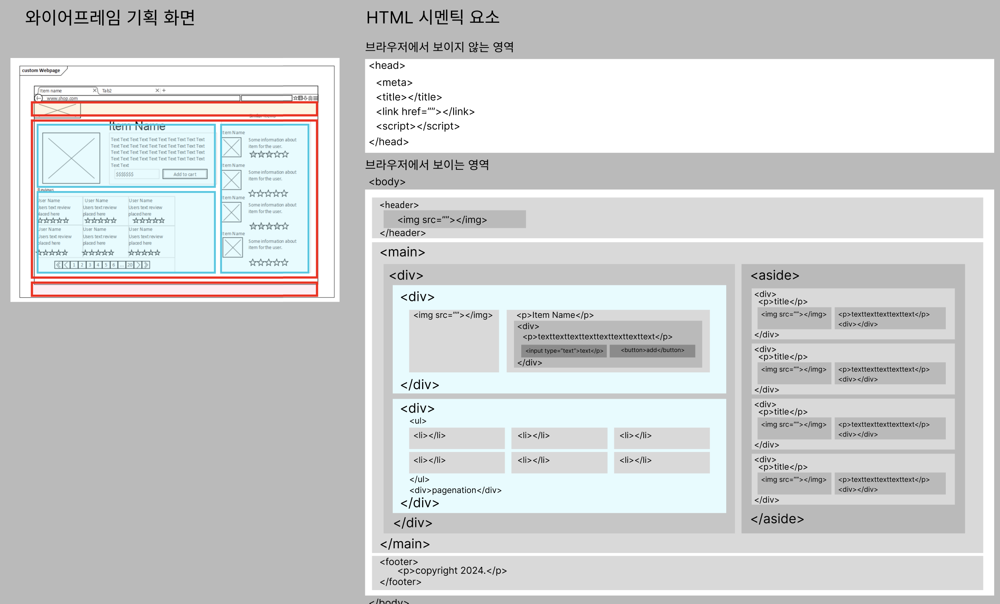

### 2024/04/05

### JavaScript

- 지난 시간 복습  
  자바스크립트 변수, 자료형, 함수, 조건문, 반복문

- basic 폴더에 있는 JavaScript 코드 잠시 살펴보기 (실행 방법)  
  1. NodeJS 설치 후 환경변수 설정한 다음 재부팅 (윈도우 기준)
  2. http 서버 설치 : `npm install -g http-server`
  3. npx 명령어를 이용한 서버 활성화 : `npx http-server ./`
  4. 서버 실행 : `http-server`

### HTML & 기획

- 데이터를 담는 언어들의 구조 살펴보기  
  1. HTML, XML, JSON, YML 구조 살펴보기
  2. 공공데이터포털에서 제공하는 포맷 종류 XML, JSON 확인
  3. 데이터를 스크립트로 파싱해서 객체나 배열에 담고 가공하는 연습  

- 자주 만나게 되는 HTML 시멘틱 태그 종류 알아보기
  ```html
  <head><body><header><main><footer><div><ul><li><a><audio><article><br/><hr/><nav><progress><option><select><option>
  <p><span><table><thead><tbody><th><tr><td><textarea><input><u><b><pre><ol>
  ```

- 아토믹 디자인 시스템  
  큰 요소 묶음, 중간 크기 요소 묶음, 작은 요소 낱개

- 와이어프레임 기획에 따라 HTML 구조를 알아보고 작성하는 방법 추측하며 연습해보기
  

- 작업 순서
  1. 기존 프로젝트가 있다면, 코드를 분석해서 구조를 살펴봐야 함
  2. 기존 프로젝트가 없다면, 무엇을 어떻게 만들지 기획이 먼저 있어야 함
  3. 위에 기획대로 HTML 태그를 작성하고
  4. CSS로 스타일을 작성해서 원하는 화면대로 요소를 배치하고
  5. JavaScript 작성해서 이벤트를 추가하거나 데이터를 가져와서 가공하는 등 코드 작성

- 기획 연습
  기획을 하기 전에 무엇을 기획해야 하는지 모르는 경우  
  예를들어 내가 만드려는 사이트가 여행 사이트라면

  1. 먼저 구글에 '여행 사이트' 라는 키워드로 검색한 후
  2. 유사한 사이트를 접속해서 홈페이지 구조가 어떻게 생겼는지 개발자도구를 열어서 확인해보기
  3. 클론 코딩으로 해당 사이트를 보고 구조를 따라서 만들어보면서 다른 회사는 어떻게 만드는지 보면서 연습하기

### JavaScript

- 자바스크립트 이어서 공부
  - 자료구조 : 배열, 객체, 스택, 큐, 맵, 셋, 연결리스트(링크드리스트), 트리 자료구조, 그래프 자료구조
  - 예외처리 : try catch, throw, finally(선택적)
  - 비동기 : 콜백 함수(setTimeout(), setInterval(), clearTimeout(), clearInterval()), Promise(all(), then(), reject(), resolve(), catch(), finally()), async await
  - 프로토타입 : 프로토타입 객체, 상속 매커니즘, 프로토타입 체인, 배열(Array.prototype 메서드, 속성), getter, setter
  - 모듈 시스템 : ES6(import, export), CommonJS(require, module.exports{})
  - 실행 컨텍스트 : 전역 실행 컨텍스트, 함수 실행 컨텍스트, 이벤트 실행 컨텍스트
  - 이벤트 루프 : 비동기 처리 메커니즘, 콜 스택, 콜백 큐, 이벤트 루프

- 브라우저 Web API  
  - DOM 의 객체 document : 노드 탐색, 문서 정보, 문서 조작, 이벤트 처리
  - document 의 메서드는 호출을 해야하므로 소괄호가 있고 속성은 소괄호가 없음  
    - 노드 탐색 : getElementById(), getElementByTagName(), getElementByClassName(), querySelector(), querySelectorAll(), documentElement, body, head
    - 문서 정보 : title, URL, domain, referrer
    - 문서 조작 : createElement(), creatTextNode(), appendChild(), removeChild()
    - 이벤트 처리 : addEventListener(), removeEventListener(), cookie, forms, images, readState

- 오픈소스 코드 읽어보는 연습
- 라이브러리 예제 코드 조립해보는 연습