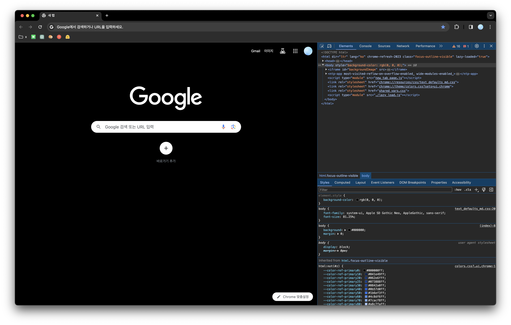

## HTML 기본 구조 살펴보기

1. 파일 생성하기  
    `index.html` , `style.css` , `script.js`

2. 주석 (Comment)  
    | 구분   | 설명     |
    |-------|---------|
    | HTML  | `<!— 내용 —>`|
    | CSS   | `/* 내용 */` |
    | JS    | `// 내용` `/* 내용 */` |
    | 단축키  | Ctrl+/ (Windows), Cmd+/ (Mac) |

<br/>

***

<br/>

## HTML에 CSS와 JS 적용하기

| 방법 | 설명 |
|-----|-----|
| HTML에 CSS와 JS 직접 추가하기 | HTML 문서 내에 `<style>` 태그와 `<script>` 태그를 사용하여 CSS와 JavaScript 코드를 직접 작성합니다. |
| HTML에 외부 CSS와 JS 파일 불러오기 | `<link>` 태그로 CSS 파일과 `<script>` 태그로 JavaScript 파일을 외부에서 불러옵니다. 이 방식은 브라우저 캐싱을 통해 페이지 로딩 성능을 개선합니다. |


```html
<!-- 1. HTML에서 직접 작성 -->
<style>여기에 스타일 작성</style>
<script>여기에 스크립트 작성</script>

<!-- 2. HTML과 CSS와 JS 파일 분리 -->
<link rel="stylesheet" type="text/css" href="style.css">
<script src="script.js"></script>

<!-- 3. HTML 코드 작성 -->
<head>
  <style>
    .a {color: red;}
    .b {color: green;}
  </style>
  <link rel="stylesheet" type="text/css" href="style.css">
</head>
<body>
  <p class="a">aaa</p>
  <p class="b">bbb</p>
  <p class="c">ccc</p>
  <p class="d">ddd</p>
  <p style="color: orange;">eee</div>
  <p style="color: orange;">fff</div>
  <script>
    document.getElementsByClassName("c")[0].style.color = "orange";
    document.getElementsByClassName("d")[0].style.color = "orange";
  </script>
  <script src="script.js"></script>
</body>
```

<br/>

***

<br/>

### CSS 스타일 적용 방법 5가지

| 방법 | 설명 | 예시 |
|------|------|------|
| HTML에 연결한 외부 스타일 파일에 작성 | 별도의 CSS 파일을 만들고 HTML 문서에 연결합니다. | `<link href="style.css" />` |
| HTML에 연결한 외부 스크립트 파일에 작성 | 별도의 JavaScript 파일을 만들고 HTML 문서에 연결합니다. | `<script src="script.js"></script>` |
| HTML 안에 스타일 태그 안에 작성 | HTML 문서 내에 `<style>` 태그를 사용하여 CSS 코드를 직접 작성합니다. | `<style> /* CSS 코드 */ </style>` |
| HTML 안에 태그에 인라인 스타일 작성 | HTML 태그에 `style` 속성을 사용하여 직접 스타일을 적용합니다. | `<p style="color: red;">Text</p>` |
| HTML 안에 스크립트 태그 안에 작성 | HTML 문서 내에 `<script>` 태그를 사용하여 JavaScript 코드를 직접 작성합니다. | `<script> /* JavaScript 코드 */ </script>` |

<br/>

***

<br/>

## 작성한 코드를 브라우저에서 확인
  브라우저에서 CSS와 JS 파일이 HTML에 제대로 연결 되었는지 확인

  - 개발자도구 살펴보기

  | 기능 | 단축키, 내용 |
  |-----|-----------|
  | 단축키로 열기 | F12 (Window), Cmd+Opt+I (Mac) |
  | 탭 내용 | 요소 선택(아이콘), 디바이스(아이콘), Elements, Console, Sources |

  

<br/>

***

<br/>

- references  
[MDN `<style>`](https://developer.mozilla.org/ko/docs/Web/HTML/Element/style)  
[MDN HTMLElement](https://developer.mozilla.org/en-US/docs/Web/API/HTMLElement/style)